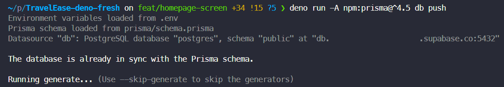

# Travel Ease

<!-- PROJECT LOGO -->
<br />
<p align="center">
  <a href="https://github.com/thidang2901/TravelEase-deno-fresh">
    
  </a>
  <h3 align="center">Travel Ease</h3>
  <p align="center">
    A web application for self-travel planning
    <br />
    <a href="https://thidang2901-travel-app.deno.dev"><strong>View Demo</strong></a>
  </p>
</p>

<!-- TABLE OF CONTENTS -->
<details>
  <summary><h2 style="display: inline-block">Table of Contents</h2></summary>
  <ol>
    <li><a href="#about-the-project">About The Project</a></li>
    <li><a href="#getting-started">Technical Stacks</a></li>
    <li><a href="#getting-started">Getting Started</a>
      <ul>
        <li><a href="#prerequisites">Prerequisites</a></li>
        <li><a href="#development"> Development</a>
        </li>
      </ul>
    </li>
    <li><a href="#deployment">Deployment</a></li>
    <li><a href="#contact">Contact</a></li>
  </ol>
</details>

## About the project

This is portfolio project using [Fresh Deno](https://fresh.deno.dev) - The
next-gen web framework.

## Technical Stacks

| <!-- -->       | <!-- -->                                        |
| -------------- | ----------------------------------------------- |
| **Language**   | TypeScript                                      |
| **Runtime**    | [Deno](https://deno.com/runtime)                |
| **Framework**  | [Fresh Deno](https://fresh.deno.dev)            |
| **Database**   | PostgreSQL on [Supabase](https://supabase.com/) |
| **ORM**        | [Prisma.io](https://www.prisma.io/)             |
| **Deployment** | [Deno Deploy](https://deno.com/deploy)          |

## Development (TBU)

### Install Deno

- Deno (latest version): https://deno.land/manual/getting_started/installation

Check Deno with `deno --version`:

```
deno 1.34.1 (release, x86_64-unknown-linux-gnu)
v8 11.5.150.2
typescript 5.0.4
```

### Setup Prisma Client

- Deno with Prisma
  [example](https://github.com/denoland/examples/tree/main/with-prisma)

- Quick check on [issues](#issues) if it might help you.

Clone the project

```
git clone https://github.com/thidang2901/TravelEase-deno-fresh.git
```

or using SSH

```
git clone git@github.com:thidang2901/TravelEase-deno-fresh.git
```

Run `prisma init` with Deno

```
deno run --allow-read --allow-env --allow-write npm:prisma@^4.5 init
```

Create new database

```
deno run -A npm:prisma@^4.5 db push
```

or

Pull current database's schema

```
deno run -A npm:prisma@^4.5 db pull
```

Generate Prisma client for Data Proxy

```
deno run -A --unstable npm:prisma@^4.5 generate --data-proxy
```

Create new seed as example Run `prisma/seed.ts`

```
deno run -A prisma/seed.ts
```

#### **Issues**

If your `deno run -A --unstable npm:prisma generate --data-proxy` did not work
well, you might run into this issue
[#19590](https://github.com/denoland/deno/issues/19590)



Just downgrade your deno version 1.34.1 with `deno upgrade --version 1.34.1` to
resolve it.

<p align="center" style="font-size:20px">
  HAPPY CODDING!
</p>

## Contact

Thi Dang (Ms.) - [LinkedIn](https://www.linkedin.com/in/thidang2901/)
